# DESIGN: Mini UI Render Pipeline 설계 문서

> **작성일**: 2026-01-29  
> **버전**: 1.0.0  
> **상태**: PLAN.md 기반 최종 설계 완료

---

## 목차

1. [개요](#1-개요)
2. [시스템 아키텍처](#2-시스템-아키텍처)
3. [핵심 설계 결정](#3-핵심-설계-결정)
4. [Dirty Flag 패턴](#4-dirty-flag-패턴)
5. [데이터 플로우](#5-데이터-플로우)
6. [클래스 설계](#6-클래스-설계)
7. [이벤트 처리 시퀀스](#7-이벤트-처리-시퀀스)
8. [레이아웃 계산](#8-레이아웃-계산)
9. [설계 트레이드오프](#9-설계-트레이드오프)
10. [구현 세부사항](#10-구현-세부사항)

---

## 1. 개요

### 1.1 목적

Mini UI Render Pipeline은 UI 트리 구조와 상태 변경 이벤트를 처리하여 다음을 결정하는 시스템입니다:

- **Structure Change**: 트리 구조 변경이 발생한 노드 목록
- **Layout Recompute**: 레이아웃 재계산이 필요한 노드 목록
- **Paint Order**: 최종 렌더링 순서

### 1.2 핵심 가치

1. **증분 업데이트**: Dirty Flag 패턴을 통한 부분 재계산
2. **결정성**: 동일 입력 → 동일 출력 보장
3. **효율성**: 변경 영향을 받는 노드만 재계산
4. **명확성**: 설계 결정의 근거를 문서화

### 1.3 설계 원칙

```diagram
[변경 감지] → [영향 분석] → [최소 재계산] → [결과 생성]
     ↓            ↓             ↓             ↓
  No-op 검출   Dirty 전파   부분 업데이트   순서 보장
```

---

## 2. 시스템 아키텍처

### 2.1 전체 아키텍처

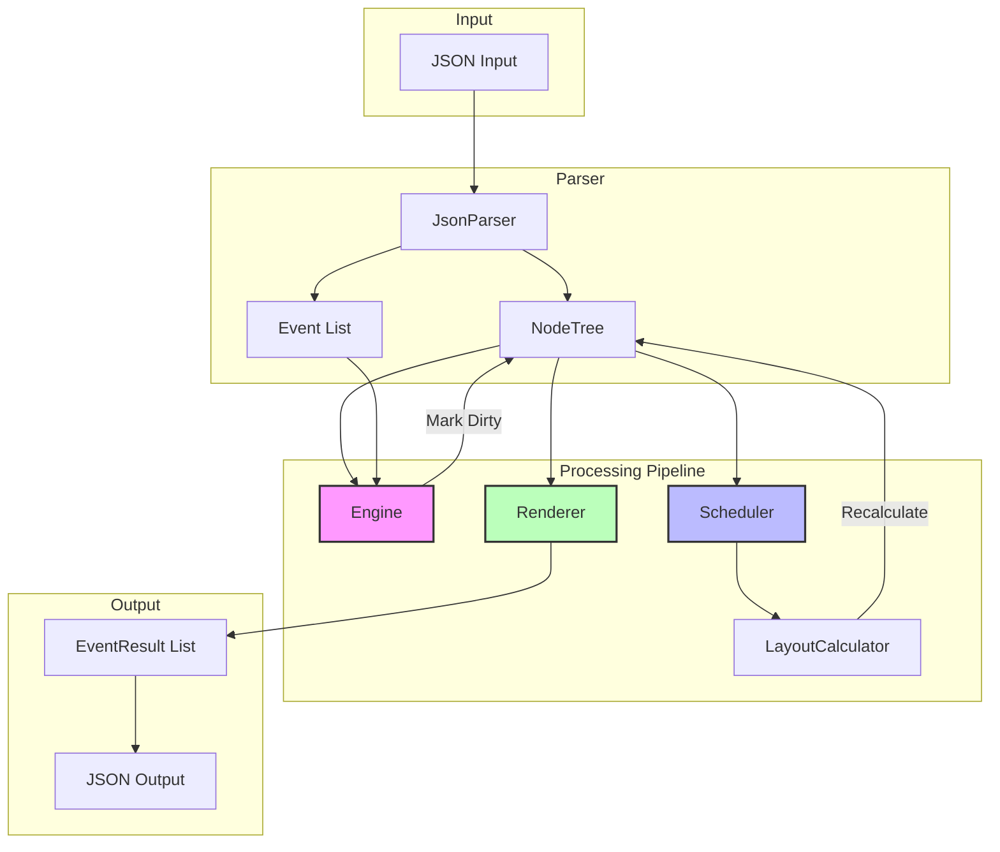

### 2.2 모듈 책임

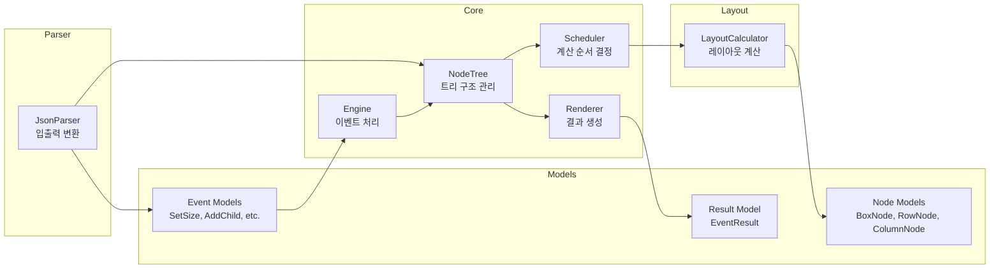

### 2.3 디렉토리 구조

```log
lib/
├── src/
│   ├── models/               # 데이터 모델
│   │   ├── node.dart         # Node 계층 구조
│   │   ├── event.dart        # Event 타입들
│   │   └── result.dart       # EventResult
│   ├── core/                 # 핵심 로직
│   │   ├── node_tree.dart    # 트리 관리
│   │   ├── engine.dart       # 이벤트 처리
│   │   ├── scheduler.dart    # 스케줄링
│   │   └── renderer.dart     # 결과 생성
│   ├── layout/               # 레이아웃 계산
│   │   └── calculator.dart
│   ├── parser/               # 입출력 변환
│   │   └── json_parser.dart
│   └── render_pipeline.dart  # Public API
└── render_pipeline.dart      # 라이브러리 진입점
```

---

## 3. 핵심 설계 결정

### 3.1 Two-Tier Dirty Flags

**결정**: `structureDirty`와 `layoutDirty` 두 가지 플래그 사용

**근거**:

- 구조 변경(addChild)과 속성 변경(setSize)의 영향 범위가 다름
- 구조 변경은 `recomputeStructure`에만 포함
- 속성 변경은 `recomputeLayout`에만 포함

```dart
abstract class Node {
  bool structureDirty = false;  // 트리 구조 변경
  bool layoutDirty = false;     // 레이아웃 재계산 필요
}
```

**효과**:

- ✅ 구조 변경과 속성 변경을 명확히 구분
- ✅ 불필요한 재계산 방지
- ✅ 결과 리스트 생성이 단순화

### 3.2 No-op Detection

**결정**: 이벤트 처리 전 변경 감지 단계에서 no-op 검출

**근거**: PLAN.md Case 1 Event 0에서 동일 크기 설정 시 `recomputeLayout: []`

```dart
// Engine.processEvent()
void _processSetSize(SetSizeEvent event) {
  final node = tree.findNode(event.targetId);

  // No-op detection
  if (node.size == event.newSize) {
    return; // No dirty marking
  }

  // Actual change
  node.size = event.newSize;
  _markDirty(node);
}
```

**효과**:

- ✅ 불필요한 dirty 전파 방지
- ✅ 성능 최적화
- ✅ 출력 정확성 보장

### 3.3 recomputeLayout 순서 규칙

**결정**: 직접 타겟 → 부모들 → 형제들 순서

**근거**: PLAN.md 섹션 4.5 및 Case 1 Event 1 예시 `["A", "R", "B"]`

```dart
// Renderer._collectLayoutNodesInOrder()
List<String> _collectLayoutNodesInOrder(String eventTargetId) {
  // 1. 직접 영향받은 노드 (이벤트 타겟)
  // 2. 부모 방향으로 전파된 노드들 (상향)
  // 3. 형제 노드들
  // 4. 기타 dirty 노드들
}
```

**효과**:

- ✅ PLAN.md 요구사항 충족
- ✅ 영향 전파 순서와 일치
- ✅ 직관적인 결과 해석

### 3.4 Pre-order DFS for Paint Order

**결정**: 부모 → 자식 순서로 paintOrder 생성

**근거**: 일반적인 렌더링 시스템에서 부모가 먼저 그려진 후 자식 그려짐

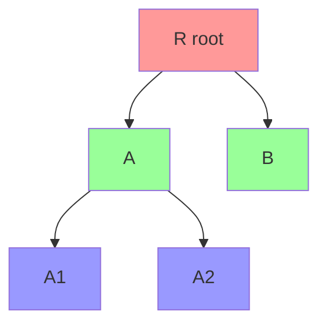

Paint Order: `[R, A, A1, A2, B]`

### 3.5 Cascading Layout Updates

**결정**: Fixed-point iteration으로 연쇄 레이아웃 업데이트 처리

**근거**: 자식 크기 변경이 부모 크기에 영향을 주고, 다시 부모가 재계산되어야 함

```dart
void _recalculateLayoutsCascading(NodeTree tree, Scheduler scheduler) {
  const maxIterations = 10;
  int iteration = 0;

  while (iteration < maxIterations) {
    final updated = scheduler.recalculateDirtyLayouts();
    if (updated.isEmpty) break;

    // Mark parents dirty for next iteration
    for (final nodeId in updated) {
      final node = tree.findNode(nodeId);
      node?.parent?.markLayoutDirty();
    }

    iteration++;
  }
}
```

**효과**:

- ✅ 중첩 구조에서 레이아웃 정확성 보장
- ✅ 무한 루프 방지 (maxIterations)
- ✅ 단순한 로직 구조

---

## 4. Dirty Flag 패턴

### 4.1 Dirty Flag 전파 규칙

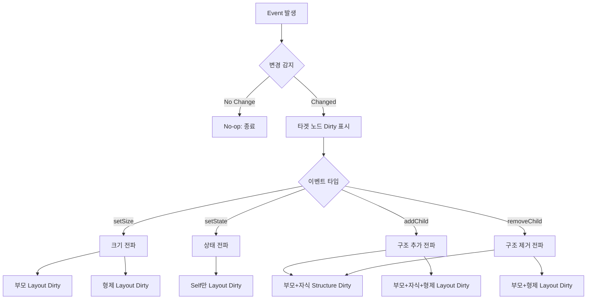

### 4.2 이벤트별 Dirty 전파 상세

#### SetSizeEvent

```diagram
Before: R (Row)
        ├── A (50×20)  ← target
        └── B (30×20)

Event: setSize(A, {w:60, h:20})

Dirty Propagation:
1. A.layoutDirty = true      (직접 변경)
2. R.layoutDirty = true      (부모: Row 너비 재계산 필요)
3. B.layoutDirty = true      (형제: 위치 재배치 필요)

Result: recomputeLayout = ["A", "R", "B"]
```

#### AddChildEvent

```diagram
Before: R (Row)
        └── A (Box)

Event: addChild(R, child: B)

Dirty Propagation:
1. R.structureDirty = true   (부모: 구조 변경)
2. B.structureDirty = true   (새 자식: 구조 추가)
3. R.layoutDirty = true      (부모: 레이아웃 재계산)
4. B.layoutDirty = true      (새 자식: 레이아웃 계산)
5. A.layoutDirty = true      (기존 형제: 위치 재배치)

Result:
  recomputeStructure = ["R", "B"]
  recomputeLayout = ["R", "A", "B"]
```

#### SetStateEvent

```diagram
Before: Header (Row, state: {color: blue})  ← target

Event: setState(Header, {color: red})

Dirty Propagation:
1. Header.layoutDirty = true  (본인만 영향)

Result: recomputeLayout = ["Header"]
```

#### RemoveChildEvent

```diagram
Before: R (Row)
        ├── A (Box)
        └── B (Box)  ← to be removed

Event: removeChild(R, childId: B)

Dirty Propagation:
1. R.structureDirty = true   (부모: 구조 변경)
2. B.structureDirty = true   (제거된 자식: 구조 표시)
3. R.layoutDirty = true      (부모: 레이아웃 재계산)
4. A.layoutDirty = true      (남은 형제: 위치 재배치)

Result:
  recomputeStructure = ["R"]  (B는 트리에서 제거되어 포함 안 됨)
  recomputeLayout = ["R", "A"]
```

### 4.3 Dirty Flag 생명주기

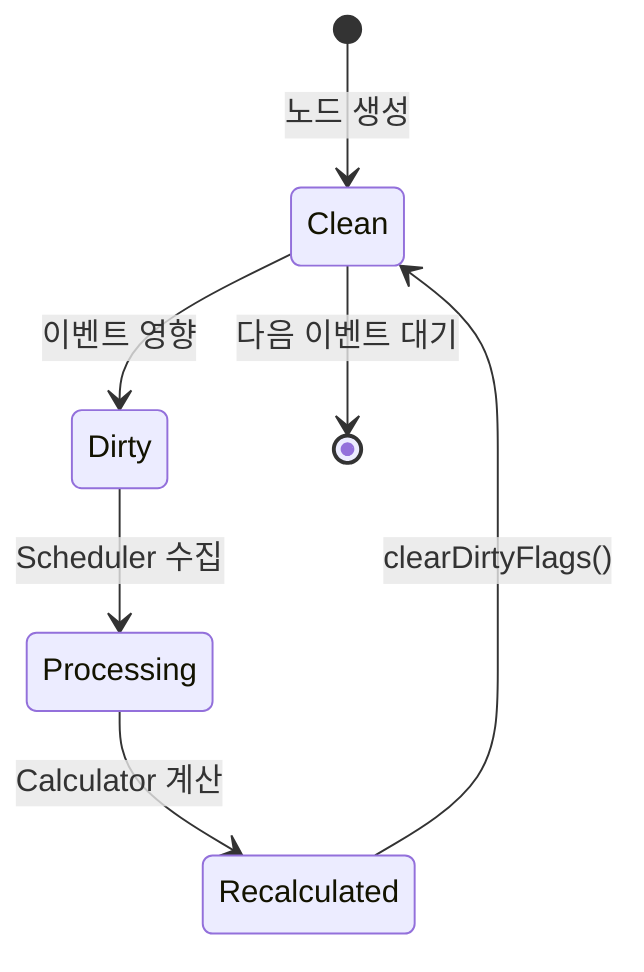

---

## 5. 데이터 플로우

### 5.1 전체 데이터 플로우

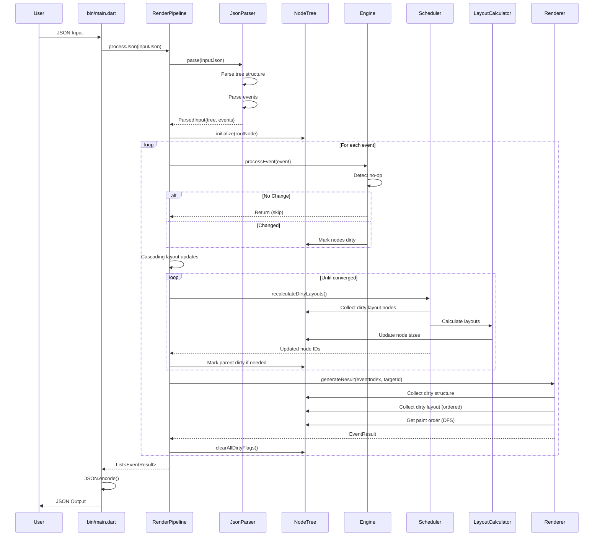

### 5.2 이벤트 처리 상세 플로우

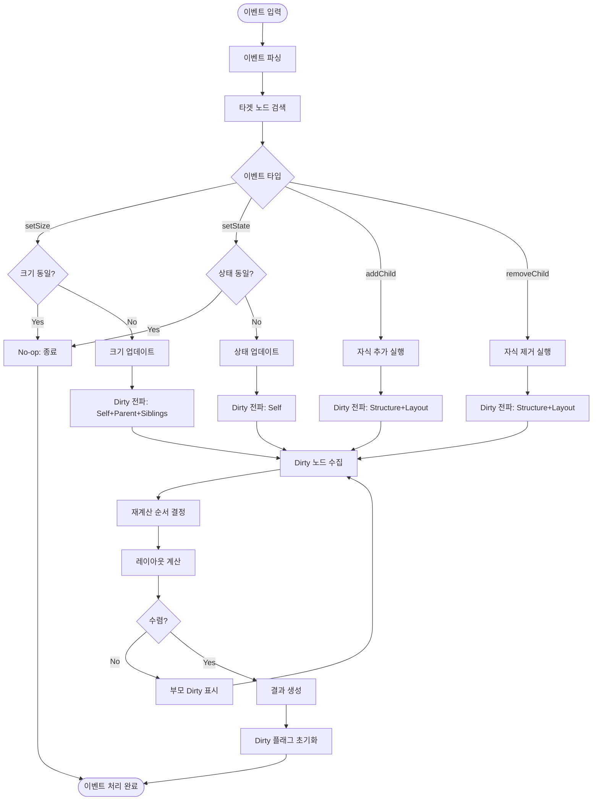

---

## 6. 클래스 설계

### 6.1 Node 계층 구조

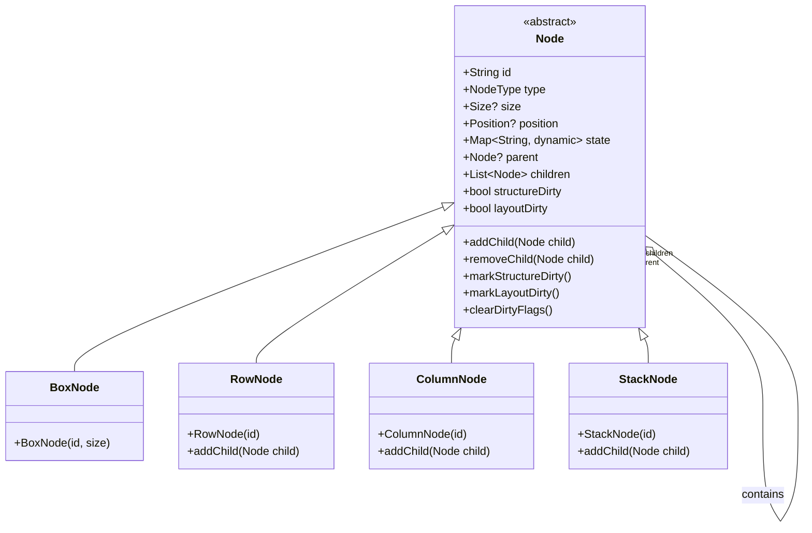

### 6.2 Event 계층 구조

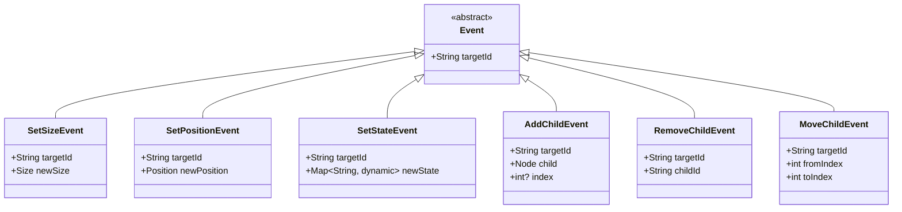

### 6.3 Core 클래스 관계

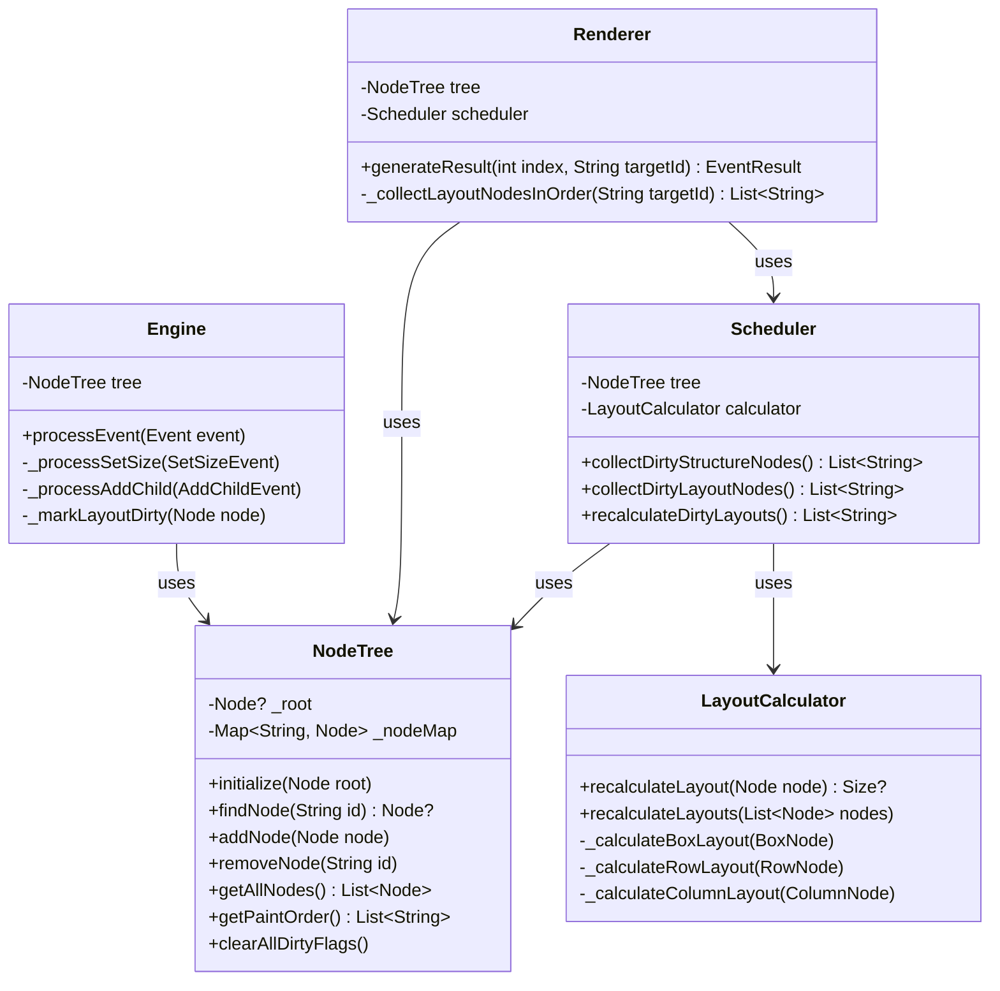

---

## 7. 이벤트 처리 시퀀스

### 7.1 SetSizeEvent 처리 시퀀스

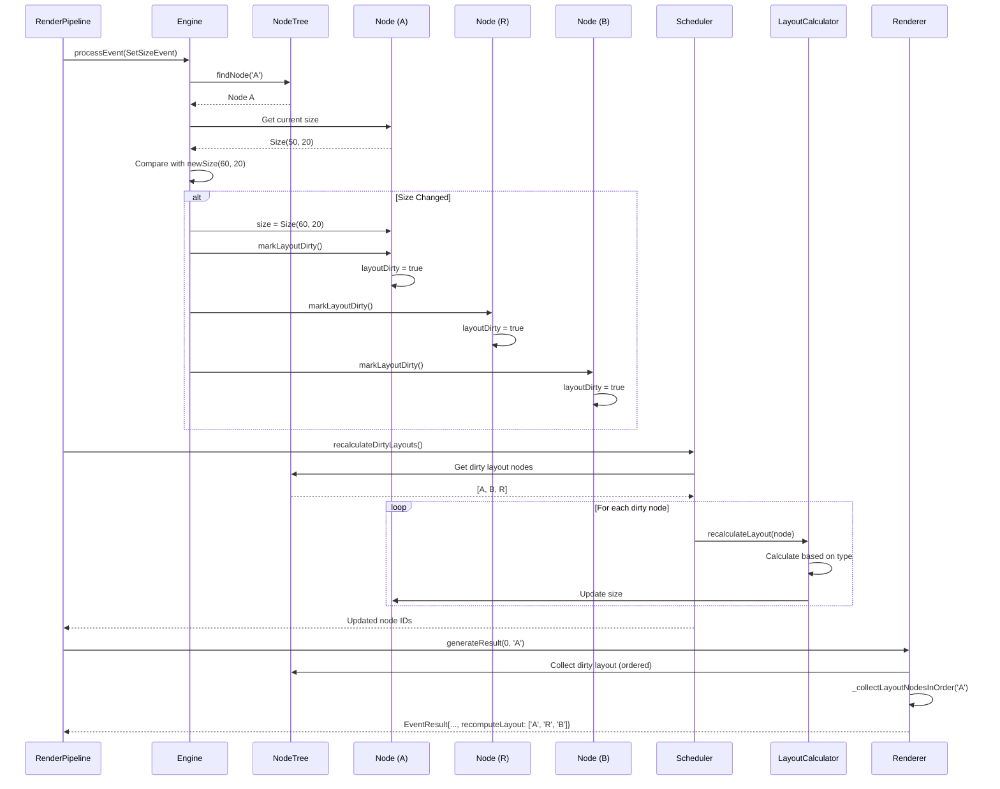

### 7.2 AddChildEvent 처리 시퀀스

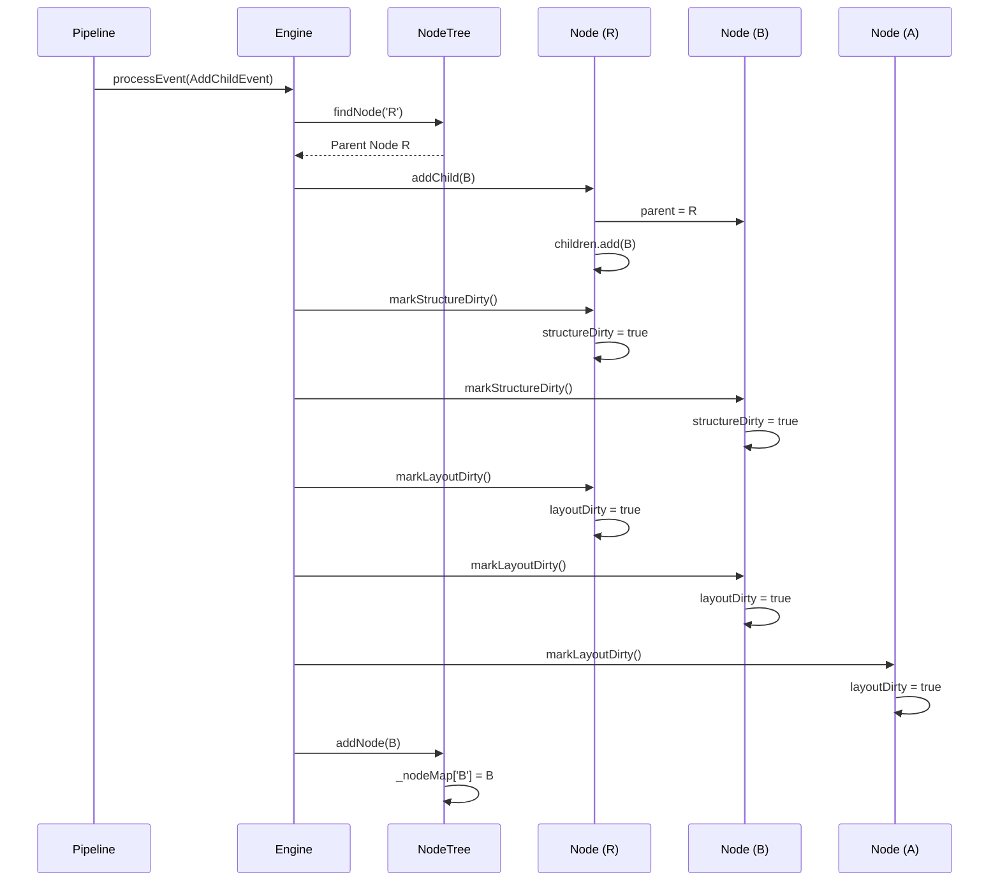

---

## 8. 레이아웃 계산

### 8.1 레이아웃 계산 알고리즘

#### Box Layout (Leaf Node)

```dart
Size? _calculateBoxLayout(BoxNode node) {
  // Box는 고정 크기를 가지므로 기존 크기 반환
  return node.size;
}
```

#### Row Layout (Horizontal)

```dart
Size? _calculateRowLayout(RowNode node) {
  if (node.children.isEmpty) return Size(width: 0, height: 0);

  double totalWidth = 0;
  double maxHeight = 0;

  for (final child in node.children) {
    if (child.size == null) return null;
    totalWidth += child.size!.width;
    maxHeight = max(maxHeight, child.size!.height);
  }

  return Size(width: totalWidth, height: maxHeight);
}
```

**시각적 예시**:

```diagram
Row R
├── A (50×20)
└── B (30×25)

R.width = 50 + 30 = 80
R.height = max(20, 25) = 25

Result: R (80×25)
```

#### Column Layout (Vertical)

```dart
Size? _calculateColumnLayout(ColumnNode node) {
  if (node.children.isEmpty) return Size(width: 0, height: 0);

  double maxWidth = 0;
  double totalHeight = 0;

  for (final child in node.children) {
    if (child.size == null) return null;
    maxWidth = max(maxWidth, child.size!.width);
    totalHeight += child.size!.height;
  }

  return Size(width: maxWidth, height: totalHeight);
}
```

**시각적 예시**:

```diagram
Column C
├── A (50×20)
└── B (30×25)

C.width = max(50, 30) = 50
C.height = 20 + 25 = 45

Result: C (50×45)
```

#### Stack Layout (Overlay)

```dart
Size? _calculateStackLayout(StackNode node) {
  if (node.children.isEmpty) return Size(width: 0, height: 0);

  double maxWidth = 0;
  double maxHeight = 0;

  for (final child in node.children) {
    if (child.size == null) return null;
    maxWidth = max(maxWidth, child.size!.width);
    maxHeight = max(maxHeight, child.size!.height);
  }

  return Size(width: maxWidth, height: maxHeight);
}
```

**시각적 예시**:

```diagram
Stack S (children overlay)
├── Background (100×100)
└── Content (50×50)

S.width = max(100, 50) = 100
S.height = max(100, 50) = 100

Result: S (100×100)
```

### 8.2 Cascading Layout Updates

**문제**: 자식 크기 변경 → 부모 크기 변경 → 다시 형제들 영향

**해결**: Fixed-point iteration

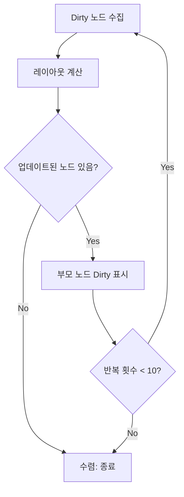

**예시**:

```diagram
Iteration 1:
- A (dirty) 재계산 → A 크기 변경
- A의 부모 R을 dirty로 표시

Iteration 2:
- R (dirty) 재계산 → R 크기 변경
- R의 부모 Root를 dirty로 표시

Iteration 3:
- Root (dirty) 재계산 → Root 크기 변경
- Root는 최상위 노드이므로 더 이상 전파 없음

수렴: 종료
```

---

## 9. 설계 트레이드오프

### 9.1 Bottom-up vs Target-first Ordering

#### 선택: Target-first (직접 타겟 → 부모 → 형제)

**장점**:

- ✅ PLAN.md 요구사항 충족
- ✅ 영향 전파 순서와 직관적으로 일치
- ✅ 디버깅 시 이해하기 쉬움

**단점**:

- ❌ 계산 순서와 출력 순서가 다름
- ❌ 이벤트 타겟 정보가 필요함

**대안**: Bottom-up depth-based ordering

- Scheduler가 depth로 정렬 (자식 → 부모)
- 계산 효율성은 높지만 PLAN.md 요구사항 불일치

**결론**: 요구사항 준수를 우선하여 Target-first 선택

### 9.2 Eager vs Lazy Recalculation

#### 선택: Eager (이벤트 직후 즉시 재계산)

**장점**:

- ✅ 단순한 로직
- ✅ 결과 생성 시 모든 계산 완료
- ✅ 일관성 보장

**단점**:

- ❌ 여러 이벤트가 연속될 때 중복 계산 가능

**대안**: Lazy (결과 생성 시점에 재계산)

- 메모리 효율성 향상
- 구현 복잡도 증가

**결론**: 단순성과 정확성을 위해 Eager 선택

### 9.3 Mutable vs Immutable Nodes

#### 선택: Mutable

**장점**:

- ✅ 메모리 효율적
- ✅ 부모-자식 관계 관리 용이
- ✅ Dirty flag 패턴과 자연스럽게 통합

**단점**:

- ❌ 상태 추적 어려움
- ❌ 병렬 처리 불가

**대안**: Immutable + Copy-on-write

- 함수형 프로그래밍 스타일
- 메모리 오버헤드 증가

**결론**: 단일 스레드 환경에서 Mutable이 적합

### 9.4 Global vs Local Node Map

#### 선택: Global (NodeTree에 중앙화)

**장점**:

- ✅ O(1) 노드 검색
- ✅ 단일 진실 공급원 (Single Source of Truth)
- ✅ 순회 성능 향상

**단점**:

- ❌ NodeTree와 Node의 결합도 증가
- ❌ 메모리 중복 (부모-자식 + Map)

**대안**: Local (각 노드가 자식만 관리)

- 메모리 효율적
- 검색 시 트리 순회 필요 (O(n))

**결론**: 성능과 편의성을 위해 Global 선택

---

## 10. 구현 세부사항

### 10.1 recomputeLayout 순서 구현

```dart
/// Collect layout dirty nodes in the correct order per PLAN.md 4.5:
/// 1. Directly affected node (event target)
/// 2. Nodes propagated upward (parents)
/// 3. Sibling nodes
List<String> _collectLayoutNodesInOrder(String eventTargetId) {
  final dirtyNodes = tree.getAllNodes()
      .where((node) => node.layoutDirty)
      .map((node) => node.id)
      .toSet();

  final result = <String>[];
  final processed = <String>{};

  // 1. Add target node first (if dirty)
  if (dirtyNodes.contains(eventTargetId)) {
    result.add(eventTargetId);
    processed.add(eventTargetId);
  }

  // 2. Add parents of target (upward propagation)
  final target = tree.findNode(eventTargetId);
  if (target != null) {
    var parent = target.parent;
    while (parent != null) {
      if (dirtyNodes.contains(parent.id) && !processed.contains(parent.id)) {
        result.add(parent.id);
        processed.add(parent.id);
      }
      parent = parent.parent;
    }
  }

  // 3. Add siblings of target
  if (target?.parent != null) {
    for (final sibling in target!.parent!.children) {
      if (sibling.id != eventTargetId &&
          dirtyNodes.contains(sibling.id) &&
          !processed.contains(sibling.id)) {
        result.add(sibling.id);
        processed.add(sibling.id);
      }
    }
  }

  // 4. Add any remaining dirty nodes (edge cases)
  for (final nodeId in dirtyNodes) {
    if (!processed.contains(nodeId)) {
      result.add(nodeId);
    }
  }

  return result;
}
```

### 10.2 No-op Detection 구현

```dart
void _processSetSize(SetSizeEvent event) {
  final node = tree.findNode(event.targetId);
  if (node == null) {
    throw ArgumentError('Node ${event.targetId} not found');
  }

  // No-op detection: compare current and new size
  if (node.size != null &&
      node.size!.width == event.newSize.width &&
      node.size!.height == event.newSize.height) {
    return; // No change, skip marking dirty
  }

  // Apply change
  node.size = event.newSize;

  // Mark dirty
  node.markLayoutDirty();
  node.parent?.markLayoutDirty();

  // Mark siblings dirty
  if (node.parent != null) {
    for (final sibling in node.parent!.children) {
      if (sibling.id != node.id) {
        sibling.markLayoutDirty();
      }
    }
  }
}
```

### 10.3 Paint Order 생성 구현

```dart
/// Get paint order (pre-order DFS).
List<String> getPaintOrder() {
  final order = <String>[];
  if (_root != null) {
    _preOrderTraversalIds(_root!, order);
  }
  return order;
}

/// Perform pre-order DFS traversal collecting node IDs.
void _preOrderTraversalIds(Node node, List<String> result) {
  result.add(node.id);  // Parent first
  for (final child in node.children) {
    _preOrderTraversalIds(child, result);  // Then children
  }
}
```

### 10.4 Dirty Flag 초기화

```dart
/// Clear all dirty flags in the tree.
void clearAllDirtyFlags() {
  for (final node in getAllNodes()) {
    node.clearDirtyFlags();
  }
}

// In Node class
void clearDirtyFlags() {
  structureDirty = false;
  layoutDirty = false;
}
```

---

## 부록 A: 용어 정의

| 용어                  | 정의                                          |
| --------------------- | --------------------------------------------- |
| **Dirty Flag**        | 노드가 재계산이 필요함을 나타내는 불린 플래그 |
| **Structure Dirty**   | 트리 구조 변경을 나타내는 플래그              |
| **Layout Dirty**      | 레이아웃 재계산이 필요함을 나타내는 플래그    |
| **Pre-order DFS**     | 부모를 자식보다 먼저 방문하는 깊이 우선 탐색  |
| **No-op**             | 실제 변경이 없어 처리를 건너뛰는 이벤트       |
| **Cascading Updates** | 변경이 연쇄적으로 전파되어 여러 노드에 영향   |
| **Fixed-point**       | 더 이상 변경이 없는 안정 상태                 |
| **Paint Order**       | 렌더링 시 노드를 그리는 순서                  |
| **Event Target**      | 이벤트가 직접 영향을 주는 노드                |

## 부록 B: 참고 자료

- **PLAN.md**: 전체 프로젝트 계획 및 요구사항
- **PROGRESS.md**: 구현 진행 상황 및 테스트 결과
- **README.md**: 프로젝트 개요 및 사용 방법
- **CLAUDE.md**: Claude Code를 위한 프로젝트 가이드

---

**문서 작성**: Claude Sonnet 4.5  
**최종 검토**: 2026-01-29
